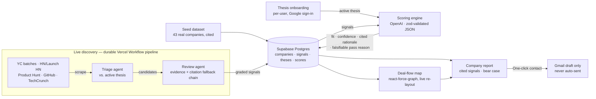

# Cormorant

**An AI venture-capital operating system.** It discovers startups, scores every one of them
against a VC's own investment thesis with cited, traceable evidence, and gives an honest,
falsifiable reason to pass on each — the bear case, not just the pitch.

Built in a ~24-hour sprint for **Hack-Nation's Global AI Hackathon — Challenge 2, "The VC
Brain"** (sponsored by Maschmeyer Group).

---

## 🔗 Live demo

**https://cormorant-vert.vercel.app**

> **Judges: your browser will show a "this site is dangerous" warning before it loads.**
> This is a false positive — Chrome/Safari flagging a brand-new `.vercel.app` subdomain,
> not a real risk. Click **Advanced → Proceed anyway** (or "visit this unsafe site") to get
> through. The app itself requires **Google sign-in** (Supabase Auth) so each judge gets
> their own private thesis workspace — the shared 43-company deal-flow pool is the same for
> everyone, only your thesis is yours.

## Why this is different

Every other team at this hackathon is building "rank startups by how promising they look."
That's hype-scoring, and VCs already distrust it.

Cormorant scores **fit to one specific investor's stated thesis**, not generic promise, and
it is designed to *argue against itself*: every score ships with a specific, falsifiable
reason to pass — the bear case a VC would actually raise in an investment committee meeting.
A system that can articulate why *not* to invest is a system a VC can trust. That's the demo
moment.

The other rule the product is built around: **no score without its signals.** Every fit
score traces back to specific, cited evidence — click through and you land on the actual
source URL, not a hand-wave.

## What it does

- **15-second thesis onboarding** — a VC describes stage, industries, traction bar, and
  free-text preferences. Multiple theses can be saved, edited, and swapped per account.
- **Evidence-backed scoring** — an LLM scores every company for fit to the *active* thesis,
  returning a zod-validated fit score, a confidence level, a cited rationale tied to
  specific signal IDs, and a falsifiable pass reason. Swap the thesis and every score
  re-runs against the new criteria.
- **Live deal-flow map** — a force-directed graph (`react-force-graph`): companies
  positioned by fit (closer to center = better fit), sized by confidence, colored by
  sector, edge-connected by shared signals (same investor, same accelerator, adjacent
  market). Re-settles live as the thesis changes or new companies are discovered.
- **Live multi-agent discovery** — a durable background pipeline (Vercel Workflow DevKit,
  survives closing the tab) that scrapes YC batches, HN/Launch HN, Product Hunt, GitHub, and
  TechCrunch, triages candidates against the active thesis, resolves and verifies citations
  through a multi-step fallback chain, and drops newly scored companies onto the map in real
  time — loop-until-target, not a fixed batch, so "find 15" actually finds 15.
- **One-click contact** — drafts a personalized outreach email straight into the signed-in
  VC's own Gmail Drafts folder (founder email auto-resolved from the company's site, fit
  reason rewritten into a plain founder-facing sentence). The app only ever *creates a
  draft* — it never sends anything, on camera or off.

## Try it in under a minute

1. **Sign in with Google.** Each account gets its own private theses; the company pool is shared.
2. **Create a thesis** — e.g. "Pre-seed, AI infra & dev tools, any traction." Takes ~15 seconds.
3. Land on the **deal-flow map** — the shared company pool scores and settles by fit to your thesis.
4. Click any node to open its **company report**: cited signals, confidence, and the specific bear case.
5. Open **Settings → live discovery**, ask it to find a few more companies, and watch new
   nodes drop onto the map and score in real time.
6. Edit your thesis (change stage or industry) and watch the whole map **re-rank live**.

## Architecture

Every number a VC sees traces back to rows in `signals`, each with a `source_url`.

## A few things worth a judge's attention

- **Discovery loops until it hits target, not a fixed round count.** An earlier version
  under-delivered (asked for 15, got 6) because it kept re-scraping the same top-of-feed
  candidates. Fixed with an exclusion set that pushes each round deeper into fresh
  candidates and a loop-until-target/loop-until-dry control flow instead of a hard round cap.
- **Citations are verified, not assumed.** The review agent resolves each source through a
  fallback chain (source page → company site → first-party feed excerpt), and bot-walled
  sources get citation-kept-but-confidence-capped signals rather than a silent drop.
- **The bear case is generated, not templated** — a specific, falsifiable reason to pass,
  scoped to the actual thesis and the actual evidence, not a boilerplate risk disclaimer.
- **Outreach drafts never leak internal analysis.** The scoring rationale is written *for
  the VC*; a separate rewrite step turns it into one founder-facing sentence before it ever
  reaches an email draft, with a jargon blocklist so internal vocabulary can't slip through.
- **The discovery pipeline is durably background, not request-bound** — built on Vercel
  Workflow DevKit (`"use workflow"`/`"use step"`), so a run survives closing the tab and
  resumes correctly.

## Stack

Next.js 16 (App Router) · TypeScript · Tailwind v4 · shadcn/ui · Vercel AI SDK (OpenAI) ·
Supabase (Postgres + Auth, Google OAuth) · Vercel Workflow DevKit (durable background
pipeline) · react-force-graph · Gmail API (draft-only outreach) · deployed on Vercel.

## Data sources

- **Pre-indexed seed dataset:** 43 real companies with real, cited signals compiled from
  public web sources — every signal stores its `source_url`.
- **Live discovery:** server-side fetch + parse over YC (4 recent batches), Hacker News
  (Show HN + Launch HN), Product Hunt, GitHub (60-day window), and TechCrunch's search API.
- **OpenAI models** for scoring, signal extraction, and discovery triage/review.

## Full build plan

[`PLAN.md`](./PLAN.md) is the single source of truth for the build: scope, tiers, data
model, scoring engine design, and the full step-by-step task breakdown with done conditions
— including everything above, in far more detail.
