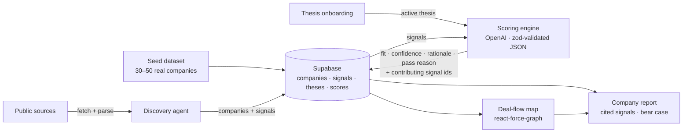

# Cormorant

An AI venture-capital operating system: it discovers startups, scores them against a VC's
stated investment thesis with traceable, cited evidence, and supports rapid decisions —
including an honest, falsifiable reason to pass on every company.

Built for Hack-Nation's Global AI Hackathon — Challenge 2, *The VC Brain* (sponsored by
Maschmeyer Group).

## What it does

- **Thesis onboarding** — a VC describes their investment thesis (stage, industries,
  traction bar, free-text) in ~15 seconds. Multiple theses can be saved and swapped.
- **Evidence-backed scoring** — every company is scored for *fit to the active thesis*, not
  generic hype. Every score traces to specific signals, each with a clickable source URL,
  plus a confidence level and a specific, falsifiable pass reason (the bear case).
- **Deal-flow map** — a live force-directed map: companies positioned by thesis fit (closer
  to center = higher fit), sized by confidence, colored by sector, connected by shared
  signals. Swap the thesis and the whole map re-settles.
- **Live discovery** — an agent finds new companies from public sources, extracts signals,
  scores them, and drops them onto the map.

## Architecture



Every number a VC sees traces back to rows in `signals`. No score without its signals.

## Stack

Next.js (App Router) · TypeScript · Tailwind v4 · shadcn/ui · Vercel AI SDK (OpenAI) ·
Supabase (Postgres) · react-force-graph · deployed on Vercel.

## Getting started

```bash
npm install
cp .env.example .env.local   # fill in the vars below
supabase db push             # apply migrations to the linked Supabase project
npm run seed                 # load the pre-indexed demo dataset
npm run dev
```

Required environment variables:

| Variable | Purpose |
| --- | --- |
| `OPENAI_API_KEY` | Scoring + discovery LLM calls |
| `SUPABASE_URL` | Supabase project URL |
| `SUPABASE_SECRET_KEY` | Server-side Supabase access (never exposed to the client) |

## Data sources

- Pre-indexed seed dataset: 30–50 real companies with real, cited signals compiled from
  public web sources (each signal stores its `source_url`). *(Finalized list documented here
  as part of Tier 6.)*
- Live discovery (Tier 4): server-side fetch + parse over a small fixed list of public
  sources.
- OpenAI models for scoring and signal extraction.

## Plan

[`PLAN.md`](./PLAN.md) is the single source of truth for the build: scope, tiers, data
model, scoring-engine requirements, and the step-by-step task breakdown with
done-conditions.
